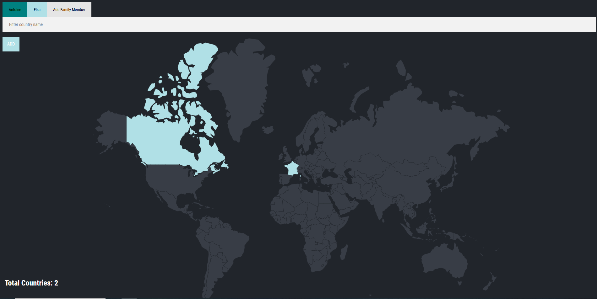

# 🌍 Family Travel Tracker

[]()

Add and track the countries visited by each member of your family. Visualize your family’s travels on a world map and keep count of everyone’s adventures!

---

## ✨ Features

- **Add Family Members:** Create a profile for each family member with a name and a color.
- **Add Countries:** Enter a country name to mark it as visited for the selected member.
- **World Map Visualization:** See visited countries highlighted on an interactive SVG map, colored by user.
- **Switch Users:** Select a family member to view and update their visited countries.
- **Total Count:** See the total number of countries visited per member.
- **Persistent Storage:** Uses PostgreSQL to store users and visited countries.

---

## 🛠️ Technologies Used

- **Backend:**
  - Node.js
  - Express
  - body-parser
  - pg (PostgreSQL client)
- **Frontend:**
  - EJS (templates)
  - HTML/CSS
  - JavaScript
- **Other:**
  - Git for version control

---

## 🚀 Installation

1. **Clone the repository:**

   ```bash
   git clone https://github.com/Antoinekoe/family-travel-tracker.git
   cd family-travel-tracker
   ```

2. **Install dependencies:**

   ```bash
   npm install
   ```

3. **Set up your PostgreSQL database:**

   - Create a database named `world`.
   - Create the tables:

     ```sql
     CREATE TABLE users (
       id SERIAL PRIMARY KEY,
       name VARCHAR(15),
       color VARCHAR(15)
     );
     CREATE TABLE visited_countries (
       id SERIAL PRIMARY KEY,
       country_code VARCHAR(2),
       user_id INTEGER
     );
     CREATE TABLE countries (
       id SERIAL PRIMARY KEY,
       country_code VARCHAR(2),
       country_name TEXT
     );
     ```

   - Fill the `countries` table with country codes and names (for example, using `countries.csv`).

4. **Configure your PostgreSQL password:**

   - In `index.js`, set your PostgreSQL password in the config:
     ```js
     password: "YOUR_PASSWORD_HERE";
     ```

5. **Start the server:**
   ```bash
   nodemon index.js
   ```
   The app will be available at `http://localhost:3000`.

---

## 🗂️ Project Structure

```
Family Travel Tracker/
├── public/
│   └── styles/
│       ├── main.css      # Main stylesheet for the app
│       └── new.css       # Stylesheet for the new user page
├── views/
│   ├── index.ejs         # Main EJS template for the homepage
│   └── new.ejs           # EJS template for adding a new user
├── index.js              # Main backend server file (Express app)
├── LICENSE               # Project license file
├── package.json          # npm configuration and dependencies
├── package-lock.json     # npm lock file for exact dependency versions
├── README.md             # Project documentation
└── screenshot-git.PNG    # Screenshot for the project
```

---

## 🤝 How to Contribute

Contributions are welcome!

1. **Fork the repository.**
2. **Create a branch for your feature or fix:**
   ```bash
   git checkout -b feature/my-new-feature
   # or
   git checkout -b bugfix/bug-fix
   ```
3. **Make your changes and commit with a clear message.**
4. **Push your branch to your fork:**
   ```bash
   git push origin feature/my-new-feature
   ```
5. **Create a pull request to the `main` branch of the original repository.**

---

## 🔧 Potential Improvements (TODO)

- Add user authentication.
- Show statistics (number of continents, percentage of the world visited, etc.).
- Allow removing a country from the visited list.
- Add autocomplete for country names.
- Improve mobile experience.

---

## 🗄️ Database Structure

### Table: `users`

| Column | Type                 | Description        |
| ------ | -------------------- | ------------------ |
| id     | integer, PRIMARY KEY | Unique user ID     |
| name   | varchar(15)          | User's name        |
| color  | varchar(15)          | User's color (CSS) |

### Table: `visited_countries`

| Column       | Type                 | Description                   |
| ------------ | -------------------- | ----------------------------- |
| id           | integer, PRIMARY KEY | Unique visit ID               |
| country_code | varchar(2)           | ISO country code (e.g., 'FR') |
| user_id      | integer              | Reference to `users.id`       |

### Table: `countries`

| Column       | Type                 | Description                   |
| ------------ | -------------------- | ----------------------------- |
| id           | integer, PRIMARY KEY | Unique countries ID           |
| country_code | varchar(2)           | ISO country code (e.g., 'FR') |
| country_name | varchar(100)         | Country name in text          |

---

## 🔑 License

This project is licensed under the MIT License - see the [LICENSE](LICENSE)
